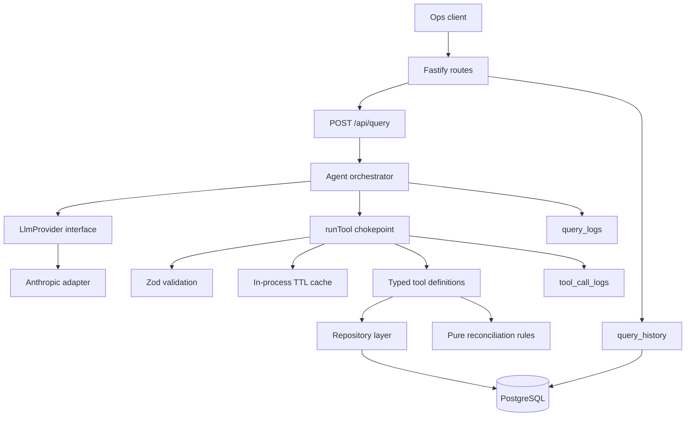

# Backend Design

## 1. Problem framing

Order operations is a multi-source consistency problem, not simple retrieval. An order can be `confirmed` while its payment is `paid` and its delivery is `not_scheduled`; a current-state lookup alone cannot explain whether that is expected, newly created, or operationally stuck. The backend therefore combines current records, payment and delivery state, and an append-only event history, then applies explicit reconciliation rules.

The language model is useful for intent recognition and answer synthesis. It is not the source of truth. Every operational fact in an answer must come from a named tool result.

## 2. Architecture



The dependency direction is intentionally downward:

| Layer | Responsibility | Boundary |
| --- | --- | --- |
| HTTP (`index.ts`, `src/api/routes.ts`) | Routing, request validation, rate limiting, serialization | Does not contain business decisions. |
| Agent (`src/agent`) | Drive model/tool turns, retries, iteration limits, issue collection | Imports only `LlmProvider`, never an SDK. |
| LLM adapters (`src/llm`) | Translate vendor request/response formats | Vendor-specific shapes stop at the adapter. |
| Tools (`src/tools`) | Define capabilities and enforce the execution chokepoint | No unvalidated database access. |
| Reconciliation (`src/reconcile`) | Evaluate cross-system consistency | Pure: no database, clock, or model. |
| Repository (`src/repo`) | Own all SQL and persistence | Higher layers do not import the database client. |

### Request flow

1. `POST /api/query` rate-limits by client IP and validates `{ query }` with Zod.
2. The Anthropic provider is created lazily and cached. Missing credentials return `503`.
3. The orchestrator creates a UUID `queryId` and sends the static system prompt, message history, and tool catalogue to Anthropic.
4. Anthropic either returns text, refuses, or requests one or more tools.
5. Requested tools run concurrently through `runTool()`.
6. All results from one model turn are sent back in one `tool_results` message. Failed calls remain present with `isError: true`.
7. The loop continues until Anthropic returns text, refuses, or reaches `AGENT_MAX_ITERATIONS`.
8. Tool calls, LLM attempts, usage, estimated costs, and query history are persisted against the same query ID.
9. The route returns the answer and the traceable execution details.

## 3. Why tools instead of direct database access

The model never receives a database connection, SQL interface, or arbitrary query capability. It can only select one of the seven registered tools and pass JSON arguments that satisfy its schema.

This provides four properties:

- **Auditability:** every tool call records its name, arguments, result, and duration.
- **Safety:** SQL remains in `src/repo`; user text cannot become SQL.
- **Testability:** tool behavior and reconciliation behavior can be tested without judging English prose.
- **Recoverability:** an unknown tool, invalid argument, or missing order becomes structured data that the model can explain or correct.

`runTool()` is the single chokepoint. It performs registry lookup, Zod validation, stable cache-key generation, cache lookup, execution, timing, and best-effort logging. Any new tool must be added to `ALL_TOOLS` so it is both executable and exposed in the Anthropic tool catalogue.

## 4. Anthropic integration

The orchestrator depends on this provider contract:

```ts
interface LlmProvider {
  readonly name: string;
  readonly model: string;
  complete(request: CompletionRequest): Promise<CompletionResponse>;
}
```

`AnthropicProvider` contains the SDK-specific behavior:

- Default model: `claude-sonnet-5`, configurable with `ANTHROPIC_MODEL`.
- Maximum output tokens: `16000`.
- Adaptive thinking is enabled with `thinking: { type: "adaptive" }`.
- Output effort is set to `medium`.
- The static system prompt uses an ephemeral cache breakpoint.
- Anthropic tool and message blocks are translated to the provider-neutral types.
- `stop_reason === "refusal"` is handled before normal text/tool parsing.
- Rate-limit, connection, authentication, malformed-request, and API errors are classified as retryable or fatal `LlmError` values.

The orchestrator retries a retryable provider failure once after 500 ms. It does not retry a refusal or a non-retryable authentication/request error. If both attempts fail, it returns a degraded, honest response rather than a server error.

The repository also includes an OpenAI adapter and a mock adapter because the provider interface is intentionally swappable. Anthropic is the configured deployment provider and the documented production path.

## 5. Data model rationale

- `orders` stores the public integer `order_no` separately from the UUID primary key. Staff and tools use the human-facing number; internal joins use UUIDs.
- `payments` and `deliveries` are separate records because their lifecycle and status vocabulary differ.
- `order_events` is append-only history. It allows the timeline tool and rules to answer what happened, not only what the current row says.
- `tool_call_logs` is a per-call audit trail grouped by `query_id`. It makes an answer replayable and exposes latency and structured results.
- `query_logs` stores each provider attempt, iteration, token usage, stop reason, duration, error, and estimated cost.
- `query_history` stores the user query, final answer, issues, tool calls, and metadata for later retrieval.

PostgreSQL is used instead of a document store because orders, payments, deliveries, and events have relational integrity and are queried together. Drizzle keeps SQL ownership explicit while retaining typed records. Monetary values use PostgreSQL `numeric(12,2)` and remain strings at the application boundary; the code does not use floating-point arithmetic for money.

## 6. Reconciliation design

`reconcileOrder(snapshot, now)` is a pure function. The current time is injected rather than read inside the rules, making date-sensitive behavior deterministic in tests.

Each rule returns either no result or an issue containing:

```ts
type Issue = {
  ruleId: RuleId;
  severity: "critical" | "warning" | "info";
  title: string;
  detail: string;
  evidence: Record<string, unknown>;
};
```

Evidence is deliberately part of the result. It gives the final answer concrete amounts, dates, statuses, and durations to cite and prevents the model from inventing operational figures.

The six current rules are:

1. Paid beyond the grace period but delivery is still `not_scheduled`.
2. Delivery is `delivered` but payment is not `paid`.
3. An order is cancelled while a captured payment has no refund event.
4. A scheduled delivery date has passed without delivery.
5. A delayed delivery has no replacement date.
6. A failed payment remains on an open order.

Critical issues are sorted before warnings. Adding a rule requires updating `RULE_IDS`, adding it to `RULES`, and adding focused tests; the test suite asserts that the IDs and implementations remain synchronized.

## 7. Trade-offs

### Synchronous tool execution

The request is synchronous because an ops question needs an answer immediately and the seeded workload is small. Independent calls requested in one Anthropic turn already execute with `Promise.all`, so a single-order question can fetch payment, delivery, and timeline data concurrently.

At larger scale, the same contract could be placed behind a job queue or stream partial progress. Fleet scans could be paginated or precomputed. Those changes would need explicit handling for query status, cancellation, and trace persistence.

### In-process caching

Successful cacheable tool results use a stable, sorted argument key and a short default TTL of 30 seconds. This reduces duplicate reads during one agent turn without making a real-time operations view stale for long. The cache is per process, so it is not a coherence mechanism. A multi-instance deployment would need a shared cache such as Redis and a decision about cross-instance freshness.

### Retry and degradation

One retry covers transient Anthropic rate-limit, connection, and server failures while bounding latency and spend. Refusals and malformed requests are not retried. When the model remains unavailable, the endpoint returns a degraded answer and any trace collected so far. The deterministic order and reconciliation endpoints remain available without the model.

### Cost tracking

Usage is recorded per LLM attempt, not inferred later from the final response. Cost rates are supplied through environment variables and calculated with integer microdollars to avoid floating-point rounding. When a rate is missing, cost is `null` and `/api/costs` reports that queries are unpriced.

## 8. Security and operational boundaries

- The model cannot execute SQL or access the database directly.
- Zod validates both HTTP inputs and model-selected tool arguments.
- SQL is centralized in repository functions and uses Drizzle query builders.
- `/api/query` has an in-memory per-IP token bucket because each accepted request can spend on Anthropic.
- Fastify logging redacts the `Authorization` header.
- Tool and query persistence is best effort: an observability write failure is logged and does not turn a completed user answer into a failed request.
- There is currently no authentication, authorization, multi-turn memory, streaming, or distributed rate limiting. Those are deployment concerns for a production system.

## 9. Testing strategy

- `tests/rules.test.ts` uses fixed clocks and in-memory snapshots to cover each rule, edge conditions, ordering, null related records, and purity.
- `tests/tools.test.ts` runs against the seeded PostgreSQL database and verifies tool results, filtering, cache behavior, not-found behavior, and trace logging.
- `tests/orchestrator.test.ts` uses `MockProvider` to verify dispatch, parallel result grouping, error recovery, retry behavior, refusals, iteration caps, and provider-neutral request construction.

The tests intentionally do not assert that Anthropic writes a particular English sentence. They assert the deterministic behavior around model decisions and the correctness of the evidence supplied to the model.
